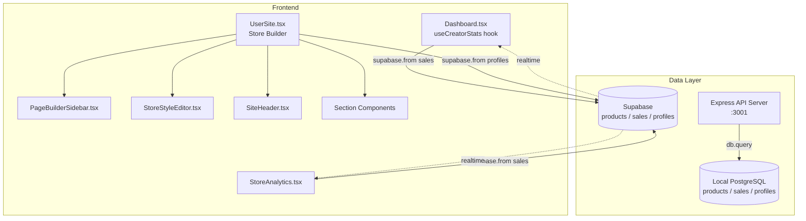
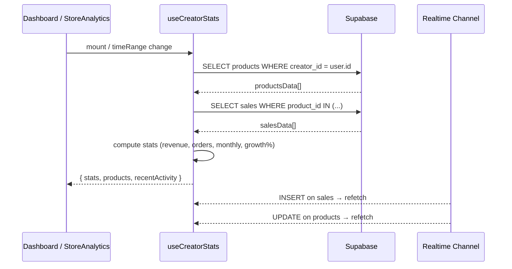
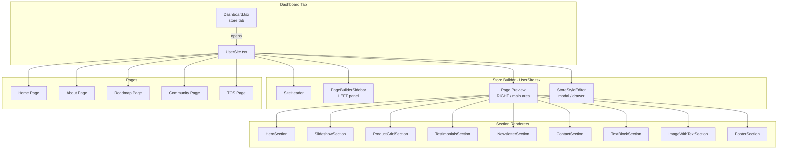
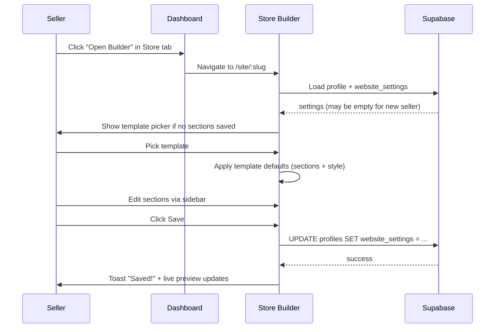

# Design Document: Analytics Fix & Store Builder

## Overview

This spec covers two tightly related improvements to the Vectabase creator platform:

1. **Analytics Fix** — ensure all dashboard and analytics page metrics (revenue, orders, downloads, growth %) pull from real data in the `sales` and `products` tables via the correct data path (Supabase or local PostgreSQL), and that the "Total Revenue" stat card never shows a misleading red 100% change when there is no previous-period data.

2. **Store Builder Polish** — evolve the existing `UserSite` / `PageBuilderSidebar` store builder into a Payhip-quality, fully self-contained experience that is easy to use, visually polished, and ships all planned sections and pages in a finished state.

Both features share the same data layer (Supabase `profiles.website_settings`, `products`, `sales`) and the same design system (pure black `#000000` background, violet/purple accents `#7c3aed` / `#8b5cf6`, shadcn/ui + Lucide icons).

---

## Architecture



---

## Part 1 — Analytics Fix

### Problem Analysis

The current `useCreatorStats` hook and `StoreAnalytics` page both query Supabase correctly, but two bugs cause bad UI:

1. **Revenue change shows -100% / red** when `previousPeriodRevenue === 0` and `totalRevenue === 0`. The formula `(0 - 0) / 0 * 100` produces `NaN`, which falls through to `0`, but the stat card still renders the red arrow because `revenueChange !== 0` check is wrong — it should also guard against `NaN`.

2. **Dashboard stat cards show `$` prefix but `useCreatorStats` returns raw numbers** — the `statsCards` array in `Dashboard.tsx` prepends `$` to `totalEarnings` and `monthlyRevenue`, but the values are already formatted as strings with `.toFixed(2)`. This is fine, but the currency symbol is hardcoded as `$` while the platform supports multiple currencies.

3. **`seller_id` filter missing in `useCreatorStats`** — the hook queries `sales` filtered by `product_id IN (...)` which is correct, but if `productIds` is empty it short-circuits to `{ data: [], error: null }` — this is correct. No bug here, but it means a seller with no products always sees zeros, which is correct behaviour.

4. **`StoreAnalytics` uses `(supabase as any).from('sales')`** — the `sales` table is not in the generated Supabase types (`src/integrations/supabase/types.ts`). This cast works at runtime but loses type safety. The fix is to add the `sales` table to the types or use a typed RPC.

### Sequence Diagram — Analytics Data Flow



### Components and Interfaces

#### `useCreatorStats` hook (fixed)

```typescript
interface CreatorStats {
  totalEarnings: number       // SUM(sales.amount) for all time
  totalDownloads: number      // SUM(products.downloads)
  activeProducts: number      // COUNT(products)
  monthlyRevenue: number      // SUM(sales.amount) last 30 days
  totalSales: number          // COUNT(sales)
  previousMonthRevenue: number // SUM(sales.amount) prior 30 days — NEW
}
```

#### `StoreAnalytics` page (fixed)

The `revenueChange` calculation must guard against division by zero and NaN:

```typescript
// FIXED: safe revenue change calculation
function safeRevenueChange(current: number, previous: number): number {
  if (previous === 0 && current === 0) return 0   // no data — show neutral
  if (previous === 0 && current > 0) return 100   // new revenue — show +100%
  return ((current - previous) / previous) * 100
}
```

The stat card must only render the change badge when `revenueChange !== 0`:

```typescript
// Only show badge when there is meaningful change data
{previousPeriodRevenue > 0 && revenueChange !== 0 && (
  <ChangeBadge value={revenueChange} />
)}
```

### Data Models

#### Sales table (already exists, no migration needed)

| Column | Type | Notes |
|--------|------|-------|
| `id` | uuid | PK |
| `product_id` | uuid | FK products.id |
| `buyer_id` | uuid | nullable |
| `seller_id` | uuid | FK users.id |
| `amount` | decimal | sale price |
| `currency` | text | default USD |
| `stripe_payment_id` | text | |
| `created_at` | timestamptz | |

The `seller_id` column allows a direct query `WHERE seller_id = user.id` without needing to join through products. This is more efficient and should be used as the primary filter in `useCreatorStats`.

### Error Handling

| Scenario | Current Behaviour | Fixed Behaviour |
|----------|------------------|-----------------|
| No sales, no previous period | Shows red -100% badge | Shows no badge (neutral) |
| Supabase `sales` table missing from types | `(supabase as any)` cast | Typed via extended types or RPC |
| Products array empty | Correct zero state | No change |
| Network error on fetch | `console.error` only | Toast error shown to user |

---

## Part 2 — Store Builder Polish

### Goals

The store builder already has a solid foundation (`UserSite.tsx`, `PageBuilderSidebar.tsx`, `StoreStyleEditor.tsx`). The goal is to make it feel as polished and easy to use as Payhip's builder, with:

- A proper **split-pane editor** UX: live preview on the right, controls on the left
- **Template picker** with 4–6 pre-built themes a seller can apply in one click
- All **section types fully implemented** (hero, slideshow, product grid, testimonials, newsletter, contact, text block, image, image+text, footer)
- **Drag-and-drop section reordering** (already partially implemented via `onReorderSections`)
- **Mobile preview toggle** in the editor toolbar
- **Publish / Save** flow with clear feedback
- All **page types** (Home, About, Roadmap, Community, TOS) fully functional and editable

### Architecture — Store Builder



### Components and Interfaces

#### Template System

```typescript
interface StoreTemplate {
  id: string
  name: string
  thumbnail: string          // preview image URL
  description: string
  settings: Partial<EditSettings>   // pre-filled style settings
  defaultSections: PageSection[]    // default section layout
}

// 6 built-in templates
const STORE_TEMPLATES: StoreTemplate[] = [
  { id: 'dark-violet',   name: 'Dark Violet',   ... },
  { id: 'midnight',      name: 'Midnight Blue',  ... },
  { id: 'minimal-light', name: 'Minimal Light',  ... },
  { id: 'neon-green',    name: 'Neon Green',     ... },
  { id: 'crimson',       name: 'Crimson',        ... },
  { id: 'forest',        name: 'Forest',         ... },
]
```

#### PageBuilderSidebar — Tab Structure

The sidebar should be reorganised into clear tabs to reduce cognitive load:

```typescript
type SidebarTab = 'pages' | 'sections' | 'style' | 'settings'

// Tab: Pages     → PageManager (add/remove/reorder pages)
// Tab: Sections  → Section list with drag handles + Add Section button
// Tab: Style     → Quick style controls (colors, fonts, background)
// Tab: Settings  → Store name, SEO, social links
```

#### Section Component Interface

Every section renderer must implement this interface for consistency:

```typescript
interface SectionRendererProps {
  section: PageSection
  products: Product[]
  isOwner: boolean
  editSettings: EditSettings
  onPurchase: (productId: string) => void
}
```

#### Mobile Preview Toggle

```typescript
interface PreviewMode {
  mode: 'desktop' | 'tablet' | 'mobile'
  width: number   // 375 | 768 | 100%
}
```

### Data Models

All store builder state is persisted in `profiles.website_settings` (JSONB column in Supabase). No new tables are needed.

```typescript
interface WebsiteSettings {
  // Style
  template: string
  background_type: 'solid' | 'gradient' | 'image' | 'gif' | 'animated_gradient'
  page_bg_color: string
  // ... (existing fields, no changes)

  // Sections
  page_sections: PageSection[]

  // Pages
  store_pages: StorePage[]

  // Per-page settings
  roadmap_settings: RoadmapSettings
  community_settings: CommunitySettings
  about_settings: AboutPageSettings
  tos_settings: TosPageSettings
  header_config: HeaderConfig
}
```

### Section Types — Full Implementation Checklist

| Section Type | Status | Notes |
|---|---|---|
| `header` | Exists, needs polish | Sticky, transparent, announcement bar |
| `hero` | Exists, needs polish | Full-screen option, CTA button |
| `slideshow` | Exists | Auto-play, dots, arrows |
| `product_grid` | Exists | Filter by collection, sort |
| `featured_products` | Exists | Manual product picker |
| `testimonials` | Stub | Needs full render + editor |
| `newsletter` | Stub | Needs Mailchimp/custom integration |
| `contact_us` | Stub | Needs form submit handler |
| `text` | Stub | Rich text / markdown |
| `image` | Stub | Full-width or contained |
| `image_with_text` | Stub | Left/right layout |
| `footer` | Exists, needs polish | Social links, copyright |
| `collections` | Exists | Tab-based collection filter |

### UX Flow — First-Time Store Setup



### Error Handling

| Scenario | Behaviour |
|----------|-----------|
| Save fails (network) | Toast error, keep unsaved state, retry button |
| Image upload fails | Toast error, revert to previous image |
| No products yet | Product grid shows "Add your first product" CTA |
| Seller not Stripe-connected | Buy buttons disabled with tooltip |
| Page type not enabled (Pro feature) | Lock icon + upgrade prompt |

### Testing Strategy

#### Unit Testing Approach

- `safeRevenueChange(current, previous)` — pure function, test all edge cases (0/0, 0/positive, positive/0, positive/positive, negative growth)
- `applyTemplate(template, currentSettings)` — verify template settings are merged correctly without overwriting user customisations
- Section renderer components — snapshot tests for each section type with mock data

#### Property-Based Testing Approach

**Property Test Library**: fast-check

- For any `salesData[]` array, `computeStats(salesData)` must never return `NaN` or `Infinity` for any numeric field
- For any `pageSections[]` array, `reorderSections(sections, fromIndex, toIndex)` must preserve all section IDs and produce a valid ordering

#### Integration Testing Approach

- Full save/load cycle: apply template → edit section → save → reload → verify settings match
- Analytics data flow: insert mock sale → verify stats update via realtime subscription

### Performance Considerations

- `useCreatorStats` fetches all sales for all products on every mount. For sellers with many sales, add pagination or aggregate via a Supabase RPC function (`get_creator_stats(user_id)`) that returns pre-computed totals.
- `UserSite.tsx` loads all products in one query. For stores with 50+ products, add cursor-based pagination to the product grid section.
- `PageBuilderSidebar.tsx` is 3890 lines — split into per-section editor components to reduce bundle size and improve maintainability.

### Security Considerations

- Store builder save (`handleSave`) must verify `isOwner === true` before calling `supabase.update`. Currently this is enforced by RLS on the `profiles` table (only the owner can update their own row), but the frontend should also guard against accidental saves.
- Image uploads go through Supabase Storage — ensure bucket policies restrict uploads to authenticated users only.
- The `contact_us` section form submit must rate-limit submissions (1 per minute per IP) to prevent spam.

### Dependencies

- `@dnd-kit/core` + `@dnd-kit/sortable` — drag-and-drop section reordering (already used or easy to add)
- `react-hot-toast` / `sonner` — already in use
- `shadcn/ui` — already in use
- `lucide-react` — already in use
- No new backend dependencies required


---

## Correctness Properties

*A property is a characteristic or behavior that should hold true across all valid executions of a system — essentially, a formal statement about what the system should do. Properties serve as the bridge between human-readable specifications and machine-verifiable correctness guarantees.*

### Property 1: safeRevenueChange never returns NaN or Infinity

*For any* two finite numbers `current` and `previous`, `safeRevenueChange(current, previous)` shall return a finite number (never `NaN`, `Infinity`, or `-Infinity`). This subsumes the 0/0 and 0/positive edge cases.

**Validates: Requirements 1.1, 1.2, 1.3, 1.4**

### Property 2: previousMonthRevenue computation correctness

*For any* array of sales records with arbitrary timestamps and amounts, the `previousMonthRevenue` value returned by `useCreatorStats` shall equal the exact sum of `amount` for records whose `created_at` falls in the window `[now - 60 days, now - 30 days)`.

**Validates: Requirements 2.2**

### Property 3: Template application preserves existing customisations

*For any* existing `WebsiteSettings` object with non-default values and any `StoreTemplate`, calling `applyTemplate(template, currentSettings)` shall produce a result where all fields that were explicitly set by the user retain their values (template defaults only fill in missing/empty fields).

**Validates: Requirements 5.3, 5.4**

### Property 4: Section renderer never throws for valid sections

*For any* valid `PageSection` object of any supported type, rendering the corresponding section component with valid props shall produce output without throwing a runtime error.

**Validates: Requirements 7.1**

### Property 5: Contact form rate limiting

*For any* two form submission events from the same session where the second occurs within 60 seconds of the first, the second submission shall be rejected and the submission count shall not increase.

**Validates: Requirements 7.4**

### Property 6: Buy buttons disabled when Stripe not connected

*For any* product section rendered with a seller profile where `stripe_connect_status` is not `'complete'` or `'connected'`, all buy/purchase buttons in that section shall have the `disabled` attribute set.

**Validates: Requirements 7.5**

### Property 7: reorderSections preserves section IDs and count

*For any* non-empty `PageSection[]` array and any valid `fromIndex` and `toIndex` within bounds, `reorderSections(sections, fromIndex, toIndex)` shall return an array with the same length and the same set of section IDs as the input.

**Validates: Requirements 8.2**

### Property 8: Save is a no-op when isOwner is false

*For any* store state, invoking the save action when `isOwner` is `false` shall not call `supabase.update` or any mutation on `profiles.website_settings`.

**Validates: Requirements 9.4**
