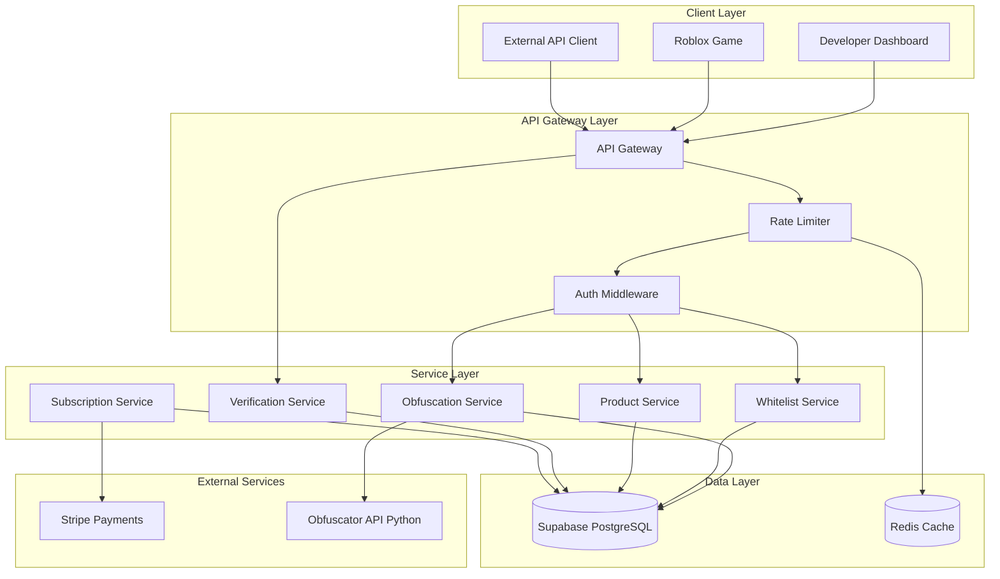
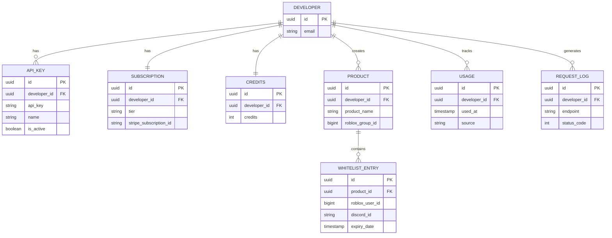

# Design Document: Developer API v1

## Overview

The Developer API v1 is a RESTful API service that provides Lua code obfuscation and user whitelisting capabilities for Roblox developers. The system is built on Supabase Edge Functions with PostgreSQL for data persistence, implementing a tiered subscription model with rate limiting and pay-per-use options.

## Architecture



## Components and Interfaces

### API Gateway

The API Gateway handles all incoming requests, routing them to appropriate services after authentication and rate limiting.

```typescript
// Base URL: /api/v1

interface APIResponse<T> {
  success: boolean;
  data?: T;
  error?: {
    code: string;
    message: string;
    details?: Record<string, string>;
  };
  request_id: string;
}

interface RateLimitHeaders {
  'X-RateLimit-Limit': number;
  'X-RateLimit-Remaining': number;
  'X-RateLimit-Reset': number; // Unix timestamp
  'Retry-After'?: number; // Seconds, only when rate limited
}
```

### Authentication Middleware

```typescript
interface AuthContext {
  developer_id: string;
  api_key: string;
  subscription_tier: 'free' | 'pro' | 'pro_plus' | 'enterprise';
  rate_limit: number; // requests per minute
}

// Validates X-API-Key header and returns developer context
async function authenticateRequest(apiKey: string): Promise<AuthContext | null>;
```

### Rate Limiter

```typescript
interface RateLimitConfig {
  free: 10,      // requests per minute
  pro: 30,
  pro_plus: 60,
  enterprise: 120
}

interface RateLimitResult {
  allowed: boolean;
  remaining: number;
  reset_at: number; // Unix timestamp
}

// Checks and updates rate limit for API key
async function checkRateLimit(apiKey: string, tier: string): Promise<RateLimitResult>;
```

### Obfuscation Service

```typescript
// POST /api/v1/obfuscate
interface ObfuscateRequest {
  code: string; // Lua source code
}

interface ObfuscateResponse {
  obfuscated_code: string;
  usage: {
    used: number;
    limit: number | 'unlimited';
    period: 'week' | 'day';
    credits_remaining: number;
  };
}

interface ObfuscationLimits {
  free: { count: 1, period: 'week' },
  pro: { count: 20, period: 'day' },
  pro_plus: { count: -1, period: 'day' }, // -1 = unlimited
  enterprise: { count: -1, period: 'day' }
}
```

### Product Service

```typescript
// POST /api/v1/products
interface CreateProductRequest {
  product_name: string;
  roblox_group_id: number;
  description?: string;
}

interface Product {
  id: string;
  developer_id: string;
  product_name: string;
  roblox_group_id: number;
  description: string | null;
  created_at: string;
  updated_at: string;
}

// GET /api/v1/products
interface ListProductsResponse {
  products: Product[];
  total: number;
}

// DELETE /api/v1/products/{product_id}
// Returns 204 No Content on success
```

### Whitelist Service

```typescript
// POST /api/v1/whitelist
interface AddWhitelistRequest {
  product_id: string;
  roblox_user_id: number;
  discord_id: string;
  expiry_date: string; // ISO 8601 date
}

interface WhitelistEntry {
  id: string;
  product_id: string;
  roblox_user_id: number;
  discord_id: string;
  expiry_date: string;
  created_at: string;
  updated_at: string;
}

// GET /api/v1/whitelist?product_id={id}&page={n}&limit={n}&roblox_user_id={id}&discord_id={id}
interface ListWhitelistResponse {
  entries: WhitelistEntry[];
  total: number;
  page: number;
  limit: number;
  tier_limit: number | 'unlimited';
}

// DELETE /api/v1/whitelist/{whitelist_id}
// Returns 204 No Content on success

// POST /api/v1/whitelist/bulk-remove
interface BulkRemoveRequest {
  whitelist_ids: string[];
}

interface BulkRemoveResponse {
  removed: number;
  failed: string[]; // IDs that failed to remove
}

interface WhitelistLimits {
  free: 10,
  pro: 100,
  pro_plus: 500,
  enterprise: -1 // unlimited
}
```

### Verification Service (Public)

```typescript
// POST /api/v1/verify (No API key required)
interface VerifyRequest {
  roblox_user_id: number;
  roblox_group_id: number;
}

interface VerifyResponse {
  whitelisted: boolean;
  expiry_date?: string; // Only present if whitelisted
}
```

### Subscription Service

```typescript
interface SubscriptionTier {
  id: 'free' | 'pro' | 'pro_plus' | 'enterprise';
  name: string;
  price_gbp: number; // Monthly price
  obfuscation_limit: number | -1; // -1 = unlimited
  obfuscation_period: 'week' | 'day';
  whitelist_limit: number | -1;
  rate_limit: number; // requests per minute
}

const SUBSCRIPTION_TIERS: SubscriptionTier[] = [
  { id: 'free', name: 'Free', price_gbp: 0, obfuscation_limit: 1, obfuscation_period: 'week', whitelist_limit: 10, rate_limit: 10 },
  { id: 'pro', name: 'Pro', price_gbp: 7, obfuscation_limit: 20, obfuscation_period: 'day', whitelist_limit: 100, rate_limit: 30 },
  { id: 'pro_plus', name: 'Pro+', price_gbp: 14, obfuscation_limit: -1, obfuscation_period: 'day', whitelist_limit: 500, rate_limit: 60 },
  { id: 'enterprise', name: 'Enterprise', price_gbp: 25, obfuscation_limit: -1, obfuscation_period: 'day', whitelist_limit: -1, rate_limit: 120 }
];

// Credits system
interface ObfuscationCredit {
  developer_id: string;
  credits: number;
  price_per_credit_gbp: 1; // £1 per credit
}
```

## Data Models

### Database Schema

```sql
-- Developer API Keys
CREATE TABLE developer_api_keys (
  id UUID PRIMARY KEY DEFAULT gen_random_uuid(),
  developer_id UUID NOT NULL REFERENCES auth.users(id) ON DELETE CASCADE,
  api_key TEXT NOT NULL UNIQUE,
  name TEXT NOT NULL DEFAULT 'Default',
  created_at TIMESTAMPTZ NOT NULL DEFAULT NOW(),
  last_used_at TIMESTAMPTZ,
  is_active BOOLEAN NOT NULL DEFAULT true,
  UNIQUE(developer_id, name)
);

-- Developer Subscriptions
CREATE TABLE developer_subscriptions (
  id UUID PRIMARY KEY DEFAULT gen_random_uuid(),
  developer_id UUID NOT NULL REFERENCES auth.users(id) ON DELETE CASCADE UNIQUE,
  tier TEXT NOT NULL DEFAULT 'free' CHECK (tier IN ('free', 'pro', 'pro_plus', 'enterprise')),
  stripe_subscription_id TEXT,
  current_period_start TIMESTAMPTZ,
  current_period_end TIMESTAMPTZ,
  created_at TIMESTAMPTZ NOT NULL DEFAULT NOW(),
  updated_at TIMESTAMPTZ NOT NULL DEFAULT NOW()
);

-- Obfuscation Credits (Pay-per-use)
CREATE TABLE obfuscation_credits (
  id UUID PRIMARY KEY DEFAULT gen_random_uuid(),
  developer_id UUID NOT NULL REFERENCES auth.users(id) ON DELETE CASCADE UNIQUE,
  credits INTEGER NOT NULL DEFAULT 0 CHECK (credits >= 0),
  updated_at TIMESTAMPTZ NOT NULL DEFAULT NOW()
);

-- Obfuscation Usage Tracking
CREATE TABLE obfuscation_usage (
  id UUID PRIMARY KEY DEFAULT gen_random_uuid(),
  developer_id UUID NOT NULL REFERENCES auth.users(id) ON DELETE CASCADE,
  used_at TIMESTAMPTZ NOT NULL DEFAULT NOW(),
  period_start TIMESTAMPTZ NOT NULL,
  source TEXT NOT NULL CHECK (source IN ('subscription', 'credit'))
);

-- Developer Products
CREATE TABLE developer_products (
  id UUID PRIMARY KEY DEFAULT gen_random_uuid(),
  developer_id UUID NOT NULL REFERENCES auth.users(id) ON DELETE CASCADE,
  product_name TEXT NOT NULL,
  roblox_group_id BIGINT NOT NULL,
  description TEXT,
  created_at TIMESTAMPTZ NOT NULL DEFAULT NOW(),
  updated_at TIMESTAMPTZ NOT NULL DEFAULT NOW(),
  UNIQUE(developer_id, roblox_group_id) -- No duplicate group IDs per developer
);

-- Whitelist Entries
CREATE TABLE whitelist_entries (
  id UUID PRIMARY KEY DEFAULT gen_random_uuid(),
  product_id UUID NOT NULL REFERENCES developer_products(id) ON DELETE CASCADE,
  roblox_user_id BIGINT NOT NULL,
  discord_id TEXT NOT NULL,
  expiry_date TIMESTAMPTZ NOT NULL,
  created_at TIMESTAMPTZ NOT NULL DEFAULT NOW(),
  updated_at TIMESTAMPTZ NOT NULL DEFAULT NOW(),
  UNIQUE(product_id, roblox_user_id) -- One entry per user per product
);

-- API Request Logs (for usage dashboard)
CREATE TABLE api_request_logs (
  id UUID PRIMARY KEY DEFAULT gen_random_uuid(),
  developer_id UUID NOT NULL REFERENCES auth.users(id) ON DELETE CASCADE,
  endpoint TEXT NOT NULL,
  method TEXT NOT NULL,
  status_code INTEGER NOT NULL,
  request_id TEXT NOT NULL,
  created_at TIMESTAMPTZ NOT NULL DEFAULT NOW()
);

-- Indexes for performance
CREATE INDEX idx_whitelist_product ON whitelist_entries(product_id);
CREATE INDEX idx_whitelist_roblox_user ON whitelist_entries(roblox_user_id);
CREATE INDEX idx_whitelist_expiry ON whitelist_entries(expiry_date);
CREATE INDEX idx_products_group ON developer_products(roblox_group_id);
CREATE INDEX idx_usage_developer_period ON obfuscation_usage(developer_id, period_start);
CREATE INDEX idx_api_logs_developer ON api_request_logs(developer_id, created_at);
```

### Entity Relationships



## Correctness Properties

*A property is a characteristic or behavior that should hold true across all valid executions of a system-essentially, a formal statement about what the system should do. Properties serve as the bridge between human-readable specifications and machine-verifiable correctness guarantees.*

### Property 1: Authentication Enforcement

*For any* API request to a protected endpoint (all except `/api/v1/verify`), if the request lacks a valid `X-API-Key` header or contains an invalid/inactive API key, the system SHALL return a 401 Unauthorized response.

**Validates: Requirements 1.1, 1.2**

### Property 2: Rate Limit Enforcement

*For any* developer with tier T making requests, if they exceed the rate limit for tier T within a one-minute window, all subsequent requests within that window SHALL return 429 Too Many Requests with appropriate `Retry-After` and `X-RateLimit-*` headers.

**Validates: Requirements 5.1, 5.2, 5.3**

### Property 3: Rate Limit Per API Key

*For any* two requests from different IP addresses using the same API key, they SHALL share the same rate limit bucket (rate limiting is per API key, not per IP).

**Validates: Requirements 5.4**

### Property 4: Obfuscation Tier Limits

*For any* developer on tier T, after exhausting their obfuscation allowance for the current period (week for Free, day for others), subsequent obfuscation requests SHALL return 429 Too Many Requests until the period resets or credits are used.

**Validates: Requirements 2.2, 2.3, 2.4, 2.5, 4.4**

### Property 5: Credit Deduction

*For any* developer with N credits (N > 0) who performs an obfuscation when subscription allowance is exhausted, the system SHALL deduct exactly 1 credit, resulting in N-1 credits remaining.

**Validates: Requirements 3.2**

### Property 6: Subscription Before Credits

*For any* developer with both subscription allowance remaining AND credits available, performing an obfuscation SHALL consume subscription allowance first, leaving credits unchanged.

**Validates: Requirements 3.3**

### Property 7: Obfuscation Usage Tracking

*For any* successful obfuscation request, the developer's usage counter for the current period SHALL increase by exactly 1.

**Validates: Requirements 4.6**

### Property 8: Product Group ID Uniqueness

*For any* developer, attempting to create a second product with the same `roblox_group_id` as an existing product SHALL return 409 Conflict error.

**Validates: Requirements 6.2, 6.3**

### Property 9: Product Deletion Cascade

*For any* product with N whitelist entries, when the product is deleted, all N whitelist entries SHALL be removed from the database.

**Validates: Requirements 6.5**

### Property 10: Whitelist Required Fields

*For any* whitelist creation request missing any of: product_id, roblox_user_id, discord_id, or expiry_date, the system SHALL return 400 Bad Request with field-specific error details.

**Validates: Requirements 7.1**

### Property 11: Whitelist Tier Limits

*For any* developer on tier T with a product that has reached the whitelist limit for tier T, attempting to add a new whitelist entry SHALL return 403 Forbidden.

**Validates: Requirements 2.6, 2.7, 2.8, 2.9, 7.4**

### Property 12: Whitelist Upsert Behavior

*For any* whitelist entry where a user (same roblox_user_id) is already whitelisted for the same product, adding them again SHALL update the existing entry (new expiry_date, updated_at) rather than creating a duplicate.

**Validates: Requirements 7.5**

### Property 13: Whitelist Expiry Validation

*For any* whitelist creation request where expiry_date is in the past relative to server time, the system SHALL return 400 Bad Request.

**Validates: Requirements 7.7**

### Property 14: Whitelist Query Completeness

*For any* product with N active whitelist entries, querying GET `/api/v1/whitelist?product_id={id}` with sufficient pagination SHALL return exactly N entries.

**Validates: Requirements 9.1**

### Property 15: Whitelist Pagination

*For any* whitelist query with page P and limit L on a product with N entries, the response SHALL contain at most L entries starting from offset (P-1)*L.

**Validates: Requirements 9.3**

### Property 16: Whitelist Filtering

*For any* whitelist query with filter parameter (roblox_user_id or discord_id), the response SHALL contain only entries matching that filter.

**Validates: Requirements 9.4**

### Property 17: Verification Correctness

*For any* verification request with roblox_user_id U and roblox_group_id G, the response SHALL return `whitelisted: true` if and only if there exists a non-expired whitelist entry for user U in any product with group_id G.

**Validates: Requirements 10.2, 10.3, 10.4**

### Property 18: Error Response Format

*For any* error response from the API, the response body SHALL contain a JSON object with `error.code`, `error.message`, and `request_id` fields.

**Validates: Requirements 12.1, 12.4**

### Property 19: Validation Error Details

*For any* request that fails validation, the error response SHALL include field-specific details in `error.details` indicating which fields failed and why.

**Validates: Requirements 12.3**

## Error Handling

### Error Codes

| HTTP Status | Error Code | Description |
|-------------|------------|-------------|
| 400 | `INVALID_REQUEST` | Request body validation failed |
| 400 | `MISSING_FIELD` | Required field is missing |
| 400 | `INVALID_EXPIRY` | Expiry date is in the past |
| 401 | `UNAUTHORIZED` | Missing or invalid API key |
| 403 | `TIER_LIMIT_EXCEEDED` | Whitelist limit for tier reached |
| 404 | `NOT_FOUND` | Resource not found |
| 409 | `DUPLICATE_GROUP` | Product with same group_id exists |
| 429 | `RATE_LIMITED` | Too many requests |
| 429 | `OBFUSCATION_LIMIT` | Obfuscation limit for period reached |
| 500 | `INTERNAL_ERROR` | Server error |

### Error Response Format

```typescript
interface ErrorResponse {
  success: false;
  error: {
    code: string;
    message: string;
    details?: Record<string, string>; // Field-specific errors
  };
  request_id: string;
}

// Example validation error
{
  "success": false,
  "error": {
    "code": "INVALID_REQUEST",
    "message": "Validation failed",
    "details": {
      "expiry_date": "Must be a future date",
      "discord_id": "Required field"
    }
  },
  "request_id": "req_abc123"
}
```

## Testing Strategy

### Unit Tests

Unit tests will verify individual component behavior:
- API key validation logic
- Rate limit calculation
- Tier limit enforcement
- Date validation for expiry
- Request/response serialization

### Property-Based Tests

Property-based tests will use a testing library (fast-check for TypeScript) to verify correctness properties across many generated inputs:

- **Minimum 100 iterations per property test**
- Each test tagged with: `Feature: developer-api-v1, Property N: [property text]`

Key property tests:
1. Authentication always rejects invalid keys
2. Rate limiting correctly tracks per API key
3. Obfuscation limits enforce tier restrictions
4. Credit deduction is atomic and correct
5. Product group uniqueness constraint holds
6. Whitelist upsert never creates duplicates
7. Verification returns correct status based on whitelist state

### Integration Tests

Integration tests will verify end-to-end flows:
- Full obfuscation flow with usage tracking
- Whitelist CRUD operations
- Verification from Roblox game perspective
- Subscription upgrade/downgrade effects

### Test Data Generators

```typescript
// Generate random valid Lua code
const luaCodeGen = fc.string({ minLength: 10, maxLength: 10000 })
  .map(s => `-- Generated\nlocal x = "${s}"\nreturn x`);

// Generate valid whitelist entry
const whitelistEntryGen = fc.record({
  roblox_user_id: fc.integer({ min: 1, max: 999999999 }),
  discord_id: fc.stringOf(fc.constantFrom(...'0123456789'), { minLength: 17, maxLength: 19 }),
  expiry_date: fc.date({ min: new Date(), max: new Date(Date.now() + 365 * 24 * 60 * 60 * 1000) })
    .map(d => d.toISOString())
});

// Generate subscription tier
const tierGen = fc.constantFrom('free', 'pro', 'pro_plus', 'enterprise');
```
