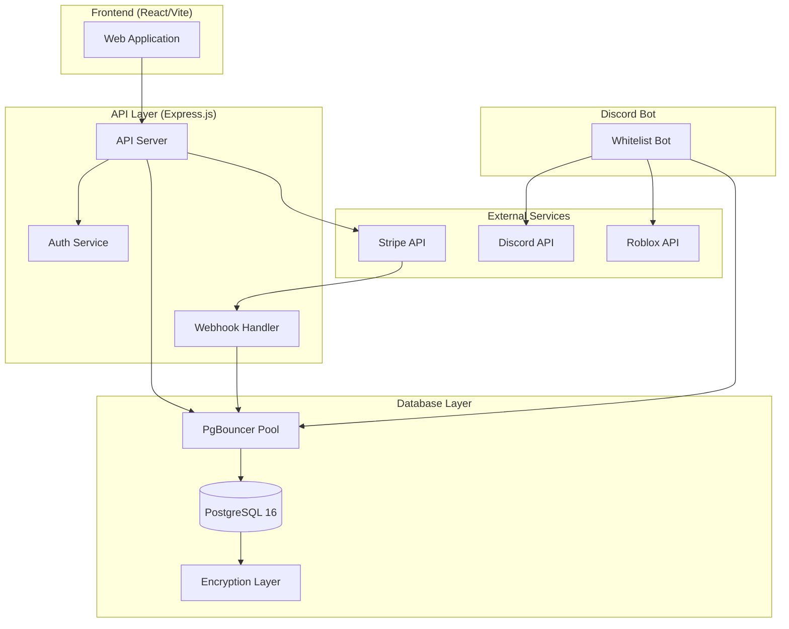

# Design Document: Local PostgreSQL Database Migration

## Overview

This design describes the migration from Supabase to a self-hosted PostgreSQL database with enterprise-grade security. The system will run locally for development and deploy to VPS via GitHub sync. All existing data, secrets, and functionality will be preserved while gaining full control over the database infrastructure.

## Architecture



## Components and Interfaces

### 1. PostgreSQL Database Server

**Location**: `database/` directory

**Configuration**:
```javascript
// database/config.js
const config = {
  host: process.env.DB_HOST || 'localhost',
  port: process.env.DB_PORT || 5432,
  database: process.env.DB_NAME || 'vectabase',
  user: process.env.DB_USER || 'vectabase_admin',
  password: process.env.DB_PASSWORD,
  ssl: process.env.NODE_ENV === 'production' ? { rejectUnauthorized: true } : false,
  max: 20, // connection pool size
  idleTimeoutMillis: 30000,
  connectionTimeoutMillis: 10000
};
```

**Schema**: All existing Supabase tables migrated with same structure:
- `users` (replaces auth.users)
- `profiles`
- `products`
- `sales`
- `stores`
- `payment_transactions`
- `whitelist_systems`
- `whitelist_users`
- `discord_servers`
- `bot_products`
- `bot_whitelisted_users`
- `bot_command_permissions`
- `developer_api_keys`
- `developer_subscriptions`
- `obfuscation_credits`
- `obfuscation_usage`
- `developer_products`
- `whitelist_entries`
- `api_request_logs`
- `secrets` (encrypted key-value store)

### 2. Encryption Layer

**Location**: `server/lib/encryption.js`

```javascript
// Encryption interface
interface EncryptionService {
  encrypt(plaintext: string): Promise<string>;
  decrypt(ciphertext: string): Promise<string>;
  rotateKey(oldKey: string, newKey: string): Promise<void>;
  deriveKey(password: string, salt: Buffer): Promise<Buffer>;
}
```

**Implementation**:
- AES-256-GCM for symmetric encryption
- PBKDF2 with 100,000 iterations for key derivation
- Random IV per encryption operation
- Authentication tag verification on decryption

### 3. Authentication Service

**Location**: `server/services/auth.js`

```javascript
// Auth service interface
interface AuthService {
  register(email: string, password: string): Promise<User>;
  login(email: string, password: string): Promise<{ user: User, token: string }>;
  verifyToken(token: string): Promise<User | null>;
  refreshToken(refreshToken: string): Promise<{ token: string, refreshToken: string }>;
  logout(userId: string): Promise<void>;
  discordOAuth(code: string): Promise<{ user: User, token: string }>;
}
```

**JWT Structure**:
```json
{
  "sub": "user_id",
  "email": "user@example.com",
  "iat": 1704067200,
  "exp": 1704153600,
  "type": "access"
}
```

### 4. API Server

**Location**: `server/` directory

**Endpoints** (replacing Supabase Edge Functions):

| Endpoint | Method | Description |
|----------|--------|-------------|
| `/api/auth/register` | POST | User registration |
| `/api/auth/login` | POST | User login |
| `/api/auth/refresh` | POST | Refresh token |
| `/api/auth/discord` | GET | Discord OAuth callback |
| `/api/stripe/onboard` | POST | Stripe Connect onboarding |
| `/api/stripe/status` | GET | Check Stripe account status |
| `/api/stripe/checkout` | POST | Create checkout session |
| `/api/stripe/webhook` | POST | Stripe webhook handler |
| `/api/products` | CRUD | Product management |
| `/api/sales` | GET | Sales data |
| `/api/whitelist` | CRUD | Whitelist management |
| `/api/developer/keys` | CRUD | API key management |
| `/api/developer/verify` | POST | Verify API key |

### 5. Migration Service

**Location**: `scripts/migrate-from-supabase.js`

```javascript
// Migration interface
interface MigrationService {
  exportFromSupabase(): Promise<ExportResult>;
  importToPostgres(data: ExportResult): Promise<ImportResult>;
  verifyMigration(): Promise<VerificationResult>;
  generateReport(): Promise<MigrationReport>;
}
```

**Migration Steps**:
1. Connect to Supabase using service role key
2. Export each table to JSON with relationships
3. Transform auth.users to local users table
4. Re-encrypt sensitive data with local keys
5. Import to PostgreSQL with transaction safety
6. Verify row counts and relationships
7. Generate migration report

### 6. Backup Service

**Location**: `server/services/backup.js`

```javascript
// Backup interface
interface BackupService {
  createBackup(): Promise<BackupResult>;
  restoreBackup(backupId: string): Promise<RestoreResult>;
  listBackups(): Promise<Backup[]>;
  deleteBackup(backupId: string): Promise<void>;
  verifyBackup(backupId: string): Promise<boolean>;
}
```

## Data Models

### User Model (replacing auth.users)

```sql
CREATE TABLE users (
  id UUID PRIMARY KEY DEFAULT gen_random_uuid(),
  email TEXT UNIQUE NOT NULL,
  password_hash TEXT NOT NULL,
  email_verified BOOLEAN DEFAULT false,
  discord_id TEXT UNIQUE,
  discord_username TEXT,
  created_at TIMESTAMPTZ DEFAULT NOW(),
  updated_at TIMESTAMPTZ DEFAULT NOW(),
  last_login_at TIMESTAMPTZ
);

CREATE INDEX idx_users_email ON users(email);
CREATE INDEX idx_users_discord_id ON users(discord_id);
```

### Sessions Table

```sql
CREATE TABLE sessions (
  id UUID PRIMARY KEY DEFAULT gen_random_uuid(),
  user_id UUID NOT NULL REFERENCES users(id) ON DELETE CASCADE,
  refresh_token_hash TEXT NOT NULL,
  expires_at TIMESTAMPTZ NOT NULL,
  created_at TIMESTAMPTZ DEFAULT NOW(),
  ip_address INET,
  user_agent TEXT
);

CREATE INDEX idx_sessions_user_id ON sessions(user_id);
CREATE INDEX idx_sessions_expires ON sessions(expires_at);
```

### Secrets Table (encrypted key-value store)

```sql
CREATE TABLE secrets (
  id UUID PRIMARY KEY DEFAULT gen_random_uuid(),
  key_name TEXT UNIQUE NOT NULL,
  encrypted_value BYTEA NOT NULL,
  created_at TIMESTAMPTZ DEFAULT NOW(),
  updated_at TIMESTAMPTZ DEFAULT NOW(),
  accessed_at TIMESTAMPTZ
);

CREATE INDEX idx_secrets_key_name ON secrets(key_name);
```

### Audit Log Table

```sql
CREATE TABLE audit_logs (
  id UUID PRIMARY KEY DEFAULT gen_random_uuid(),
  user_id UUID REFERENCES users(id),
  action TEXT NOT NULL,
  resource_type TEXT NOT NULL,
  resource_id TEXT,
  details JSONB,
  ip_address INET,
  created_at TIMESTAMPTZ DEFAULT NOW()
);

CREATE INDEX idx_audit_logs_user ON audit_logs(user_id, created_at DESC);
CREATE INDEX idx_audit_logs_resource ON audit_logs(resource_type, resource_id);
```

## Correctness Properties

*A property is a characteristic or behavior that should hold true across all valid executions of a system—essentially, a formal statement about what the system should do. Properties serve as the bridge between human-readable specifications and machine-verifiable correctness guarantees.*

### Property 1: Migration Row Count Consistency

*For any* table being migrated, the row count in the source Supabase database should equal the row count in the destination PostgreSQL database after migration completes.

**Validates: Requirements 2.4**

### Property 2: Foreign Key Relationship Preservation

*For any* record with a foreign key reference in the source database, after migration the same foreign key relationship should exist and be valid in the destination database.

**Validates: Requirements 2.2**

### Property 3: Encryption Round-Trip Consistency

*For any* plaintext value, encrypting it and then decrypting the result should produce the original plaintext value.

**Validates: Requirements 3.4**

### Property 4: Key Rotation Data Preservation

*For any* encrypted data, after performing a key rotation operation, decrypting with the new key should return the original plaintext value.

**Validates: Requirements 3.5**

### Property 5: Sensitive Data Encryption

*For any* sensitive field (API keys, Stripe IDs, tokens, license keys), the value stored in the database should not equal the plaintext value.

**Validates: Requirements 3.2**

### Property 6: JWT Token Expiry Consistency

*For any* valid login, the issued JWT token should have an expiry time matching the configured token lifetime.

**Validates: Requirements 4.3**

### Property 7: Session Creation on Login

*For any* successful authentication, a corresponding session record should exist in the sessions table.

**Validates: Requirements 4.5**

### Property 8: Invalid Token Rejection

*For any* invalid or expired JWT token, the authentication middleware should return a 401 Unauthorized response.

**Validates: Requirements 4.7**

### Property 9: Rate Limiting Enforcement

*For any* API key, requests exceeding the configured rate limit should receive a 429 Too Many Requests response.

**Validates: Requirements 5.4**

### Property 10: Request Logging Completeness

*For any* API request, a corresponding log entry with a unique request ID should exist in the logs.

**Validates: Requirements 5.5**

### Property 11: Error Response Structure

*For any* failed API request, the response should contain a consistent error structure with `error`, `message`, and `requestId` fields.

**Validates: Requirements 5.6**

### Property 12: Whitelist Persistence Immediacy

*For any* whitelist entry creation or update, the data should be immediately queryable from the database after the operation completes.

**Validates: Requirements 6.3, 6.4**

### Property 13: Backup Integrity Verification

*For any* completed backup, the integrity verification should confirm the backup can be successfully restored.

**Validates: Requirements 7.5**

### Property 14: Slow Query Logging

*For any* database query exceeding 100ms execution time, a corresponding slow query log entry should exist.

**Validates: Requirements 8.5**

### Property 15: Secret Access Audit Trail

*For any* secret access operation, an audit log entry should be created with the accessor's identity and timestamp.

**Validates: Requirements 9.5**

### Property 16: Secret Value Non-Logging

*For any* operation involving secrets, the application logs should not contain the plaintext secret values.

**Validates: Requirements 9.4**

### Property 17: Real-Time Update Broadcasting

*For any* data modification, all WebSocket clients subscribed to that resource should receive the update notification.

**Validates: Requirements 10.4**

## Error Handling

### Database Connection Errors

```javascript
// Retry with exponential backoff
const retryConfig = {
  maxRetries: 5,
  initialDelay: 1000,
  maxDelay: 30000,
  backoffMultiplier: 2
};
```

### Encryption Errors

- Invalid key: Return clear error, do not expose key details
- Decryption failure: Log attempt, return generic error
- Key rotation failure: Rollback transaction, alert admin

### API Errors

Standard error response format:
```json
{
  "error": "ERROR_CODE",
  "message": "Human readable message",
  "requestId": "uuid-for-debugging",
  "timestamp": "2026-01-09T12:00:00Z"
}
```

## Testing Strategy

### Unit Tests

- Encryption/decryption functions
- JWT token generation and validation
- Password hashing and verification
- Database query builders
- Rate limiting logic

### Property-Based Tests

Using `fast-check` library for JavaScript:

1. **Encryption round-trip** (Property 3)
2. **Migration row counts** (Property 1)
3. **Foreign key preservation** (Property 2)
4. **Token expiry consistency** (Property 6)
5. **Rate limiting enforcement** (Property 9)

Configuration: Minimum 100 iterations per property test.

### Integration Tests

- Full authentication flow
- Stripe webhook handling
- Migration end-to-end
- Backup and restore cycle

### Test File Structure

```
tests/
├── unit/
│   ├── encryption.test.js
│   ├── auth.test.js
│   └── database.test.js
├── property/
│   ├── encryption.property.test.js
│   ├── migration.property.test.js
│   └── api.property.test.js
└── integration/
    ├── auth.integration.test.js
    ├── stripe.integration.test.js
    └── migration.integration.test.js
```
