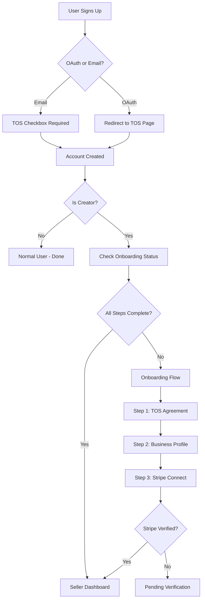

# Design Document: Seller Onboarding

## Overview

This design implements a multi-step seller onboarding flow for Vectabase. The flow ensures all sellers (email or OAuth signup) complete TOS agreement, business profile setup, and Stripe Connect integration before accessing seller features. The system uses a step-based state machine to track progress and enforce completion.

## Architecture



## Components and Interfaces

### 1. Onboarding Page Component (`/onboarding`)

```typescript
interface OnboardingStep {
  id: 'tos' | 'profile' | 'stripe';
  title: string;
  description: string;
  completed: boolean;
}

interface OnboardingState {
  currentStep: number;
  steps: OnboardingStep[];
  isLoading: boolean;
  error: string | null;
}
```

### 2. Onboarding Status Hook

```typescript
interface OnboardingStatus {
  tos_agreed: boolean;
  tos_agreed_at: string | null;
  tos_version: string | null;
  profile_completed: boolean;
  stripe_connected: boolean;
  stripe_account_id: string | null;
  stripe_status: 'pending' | 'incomplete' | 'complete' | null;
  is_fully_onboarded: boolean;
}

function useOnboardingStatus(): {
  status: OnboardingStatus | null;
  isLoading: boolean;
  refetch: () => void;
  updateStatus: (updates: Partial<OnboardingStatus>) => Promise<void>;
}
```

### 3. Protected Route Wrapper

```typescript
interface SellerRouteProps {
  children: React.ReactNode;
  requireOnboarding?: boolean;
}

// Wraps seller routes to enforce onboarding completion
function SellerRoute({ children, requireOnboarding = true }: SellerRouteProps): JSX.Element
```

### 4. Stripe Connect Service

```typescript
interface StripeConnectService {
  createConnectAccount(userId: string): Promise<{ accountId: string; onboardingUrl: string }>;
  getAccountStatus(accountId: string): Promise<StripeAccountStatus>;
  createAccountLink(accountId: string, returnUrl: string): Promise<string>;
}
```

## Data Models

### Database Schema Updates

```sql
-- Add onboarding fields to profiles table
ALTER TABLE profiles ADD COLUMN IF NOT EXISTS tos_agreed_at TIMESTAMPTZ;
ALTER TABLE profiles ADD COLUMN IF NOT EXISTS tos_version TEXT;
ALTER TABLE profiles ADD COLUMN IF NOT EXISTS business_name TEXT;
ALTER TABLE profiles ADD COLUMN IF NOT EXISTS business_description TEXT;
ALTER TABLE profiles ADD COLUMN IF NOT EXISTS contact_email TEXT;
ALTER TABLE profiles ADD COLUMN IF NOT EXISTS onboarding_completed_at TIMESTAMPTZ;
```

### Profile Model Extension

```typescript
interface SellerProfile {
  // Existing fields
  id: string;
  user_id: string;
  display_name: string;
  avatar_url: string | null;
  is_creator: boolean;
  
  // New onboarding fields
  tos_agreed_at: string | null;
  tos_version: string | null;
  business_name: string | null;
  business_description: string | null;
  contact_email: string | null;
  onboarding_completed_at: string | null;
  
  // Stripe fields (existing)
  stripe_connect_account_id: string | null;
  stripe_connect_status: 'pending' | 'incomplete' | 'complete' | null;
}
```

## Correctness Properties

*A property is a characteristic or behavior that should hold true across all valid executions of a system—essentially, a formal statement about what the system should do. Properties serve as the bridge between human-readable specifications and machine-verifiable correctness guarantees.*

### Property 1: TOS Agreement Blocks Seller Access

*For any* user who has not agreed to TOS (tos_agreed_at is null), attempting to access any seller feature (dashboard, product creation, analytics) SHALL result in a redirect to the TOS agreement page.

**Validates: Requirements 1.4, 1.5**

### Property 2: Onboarding Status Completeness Check

*For any* user profile, the is_fully_onboarded status SHALL be true if and only if: tos_agreed_at is not null AND business_name is not null AND stripe_connect_status equals 'complete'.

**Validates: Requirements 2.3, 2.5**

### Property 3: Onboarding Step Navigation

*For any* user with incomplete onboarding, logging in SHALL redirect them to the first incomplete step in the sequence: TOS → Profile → Stripe.

**Validates: Requirements 2.1, 2.4**

### Property 4: Business Profile Validation

*For any* business profile submission, the system SHALL reject submissions where business_name is empty or business_description exceeds 500 characters, returning specific error messages for each invalid field.

**Validates: Requirements 3.2, 3.5, 3.6**

### Property 5: Contact Email Default

*For any* new seller profile, if contact_email is not provided, it SHALL default to the user's account email address.

**Validates: Requirements 3.4**

### Property 6: Stripe Webhook Status Update

*For any* Stripe Connect webhook event indicating account verification status change, the system SHALL update the corresponding user's stripe_connect_status field to match the Stripe account's charges_enabled and payouts_enabled state.

**Validates: Requirements 4.3, 4.6**

### Property 7: Non-Creator Onboarding Skip

*For any* user who signs up without is_creator set to true, the system SHALL not require or redirect to seller onboarding, but SHALL prompt for onboarding when they attempt to create a product.

**Validates: Requirements 6.1, 6.3**

## Error Handling

| Error Scenario | Handling Strategy |
|----------------|-------------------|
| TOS agreement fails to save | Show error toast, allow retry |
| Profile validation fails | Display inline field errors |
| Stripe Connect creation fails | Show error with retry button |
| Stripe webhook verification fails | Log error, don't update status |
| User navigates away mid-onboarding | Save progress, resume on return |

## Testing Strategy

### Unit Tests
- Onboarding status calculation logic
- Form validation functions
- Step navigation logic
- Route protection logic

### Property-Based Tests
- Use fast-check library for TypeScript
- Minimum 100 iterations per property
- Test onboarding status completeness with random profile states
- Test validation with random input strings
- Test access control with random user states

### Integration Tests
- Full onboarding flow completion
- Stripe Connect webhook handling
- OAuth → TOS redirect flow
